# Export Custom Fields

<div align="center">
    <h2>Export Custom Fields</h2>
    <p><em>Export Your Frappe Customizations to Version Control</em></p>


</div>

---

## 📋 Description

- Export custom fields and property setters from database to JSON files
- Export server scripts and client scripts to fixtures folder
- Export custom HTML blocks with complete data (HTML, CSS, JavaScript)
- Module-based organization for easy management
- One-click export functionality for all customizations
- Standard JSON format compatible with Frappe's import/export tools
- Ready for version control and Git tracking
- Easy deployment across different environments
- Backup and recovery solution for customizations
- Developer mode security for safe operations

---

## 📺 Video Tutorial

<div align="center">

[](https://www.youtube.com/watch?v=d0xk5-Ye0JM)

_Click the image above to watch the tutorial video_

</div>

---

## ✨ Features

- **One-Click Export**: Export all customizations for any module with a single button click
- **Module-Based Organization**: Automatically organizes exports by module, keeping your customizations structured
- **Sync on Migrate**: Optional automatic synchronization during migrations
- **Standard JSON Format**: Exports in Frappe's standard JSON format, compatible with built-in import/export tools
- **Version Control Ready**: All exported files are ready to be committed to Git
- **Developer Mode Security**: All export functions only work when developer mode is enabled
- **Easy Deployment**: Ready for deployment across different environments

---

## 🚀 How to Use

### Feature 1: Export Custom Field

**How to Use:**

1. Navigate to any **Custom Field** form
2. Ensure the document has a **module** assigned
3. Click the **📦 Export to Module** button (appears in developer mode)
4. All custom fields for that module will be exported

### ❌ Old Issue

Manually tracking custom fields is time-consuming and error-prone. There's no easy way to export custom fields by module for version control and deployment. Custom fields are stored in the database and difficult to manage across different environments.

### ✅ New Solution

One-click export of all custom fields for any module. Automatically organizes exports by module and groups them by DocType. Exports to standard JSON format compatible with Frappe's import/export tools.

### 📁 Export Location

```
{app_name}/{module_name}/custom/{doctype_name}.json
```

### 📸 Images

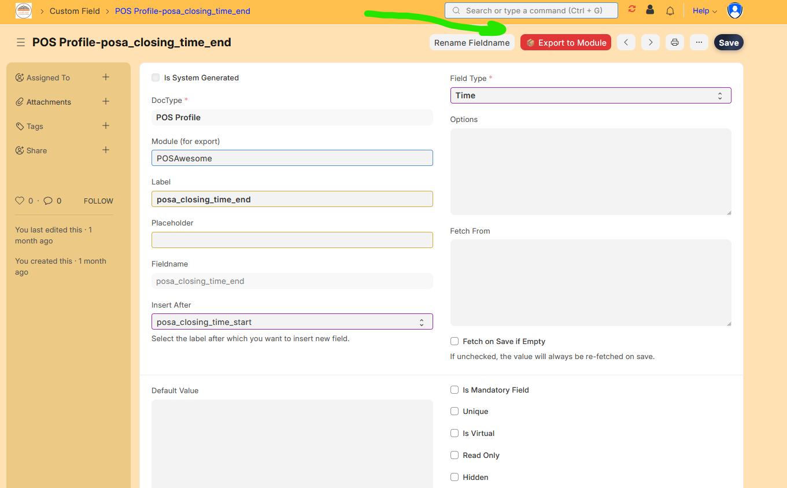
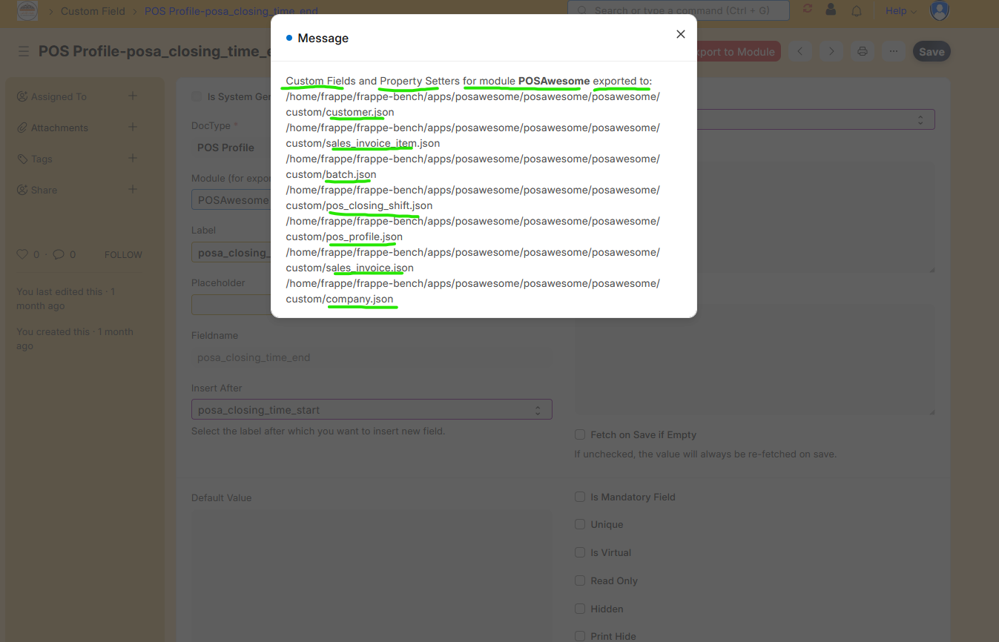

---

### Feature 2: Export Property Setter

**How to Use:**

1. Navigate to any **Property Setter** form
2. Ensure the document has a **module** assigned
3. Click the **📦 Export to Module** button (appears in developer mode)
4. All property setters for that module will be exported

### ❌ Old Issue

Property setters are stored in the database without an easy way to export them by module. No simple solution for tracking property setter changes in version control or deploying them across environments.

### ✅ New Solution

Export all property setters for a specific module with one click. Automatically grouped by DocType and exported in standard JSON format. Ready for version control and deployment.

### 📁 Export Location

```
{app_name}/{module_name}/custom/{doctype_name}.json
```

### 📸 Images

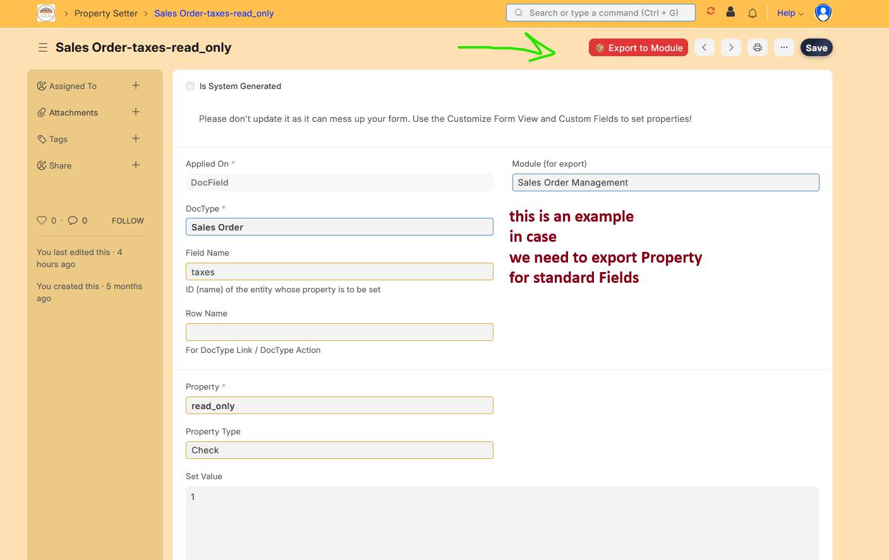

---

### Feature 3: Export Server Script

**How to Use:**

1. Open any **Server Script** form
2. Ensure the script has a **module** assigned
3. Click the **📦 Export to Module** button
4. All server scripts for that module will be exported

### ❌ Old Issue

Server scripts are stored in the database and difficult to track in version control. No simple way to export scripts by module for deployment. Script execution order and metadata are hard to preserve.

### ✅ New Solution

Export all server scripts for a specific module to fixtures folder. Maintains script execution order (idx) and creation timestamps. Ready for deployment across environments with complete script configurations.

### 📁 Export Location

```
{app_name}/fixtures/server_script.json
```

### 📸 Images

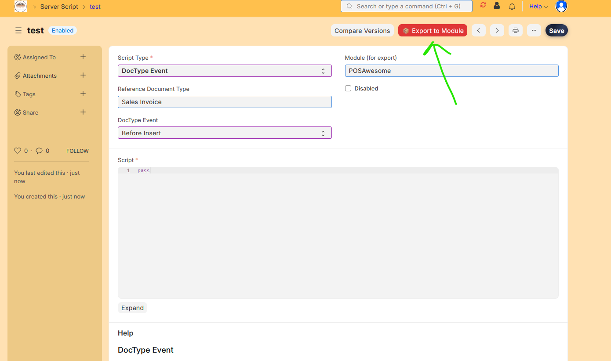
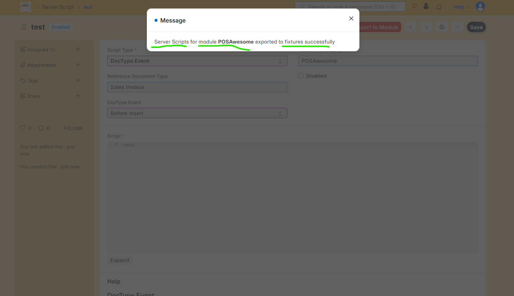

---

### Feature 4: Export Client Script

**How to Use:**

1. Open any **Client Script** form
2. Ensure the script has a **module** assigned
3. Click the **📦 Export to Module** button
4. All client scripts for that module will be exported

### ❌ Old Issue

Client scripts need to be exported for version control and deployment, but there's no module-based export functionality available. Script configurations, conditions, and code are difficult to track and deploy.

### ✅ New Solution

Export client scripts filtered by module directly to fixtures folder. Includes all script configurations, conditions, and code. Perfect for Git tracking and deployment with complete data preservation.

### 📁 Export Location

```
{app_name}/fixtures/client_script.json
```

### 📸 Images

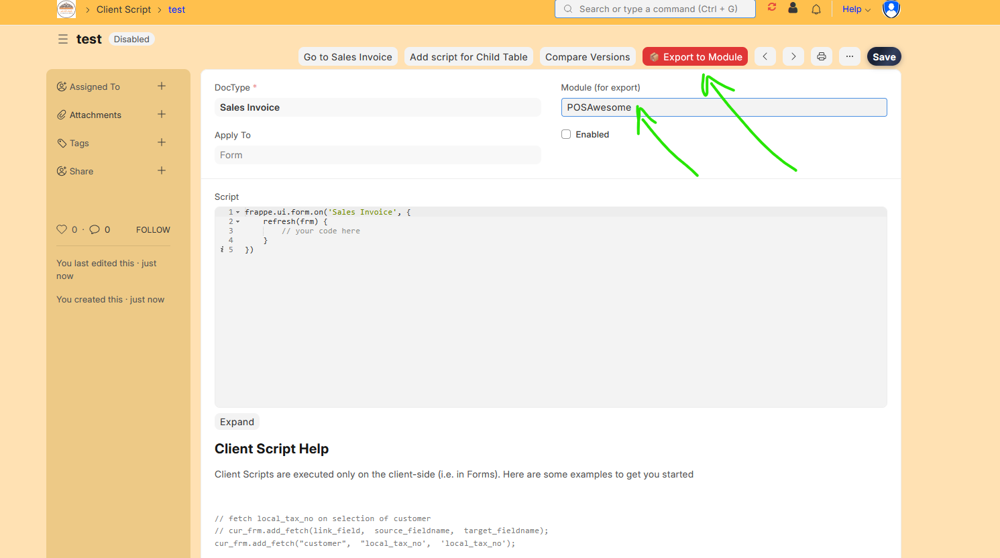
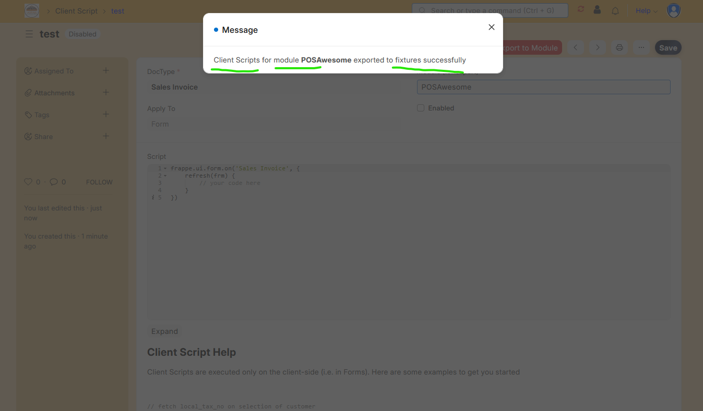

---

### Feature 5: Export Custom HTML Block

**How to Use:**

1. Open any **Custom HTML Block** form
2. Ensure the block is saved (has a name)
3. Click the **📦 Export to Module** button
4. Select the target module in the prompt dialog
5. Choose "Sync on Migrate" option if desired
6. Click Submit to export

### ❌ Old Issue

Custom HTML Blocks are stored in the database without an easy way to export them to fixtures for version control and deployment across environments. HTML, CSS, and JavaScript content cannot be easily tracked or deployed.

### ✅ New Solution

Export individual Custom HTML Blocks to fixtures folder with module selection. Exports complete block data including HTML, CSS, and JavaScript content. Ready for migration and deployment with one-click functionality.

### 📁 Export Location

```
{app_name}/fixtures/custom_html_block.json
```

### 📸 Images

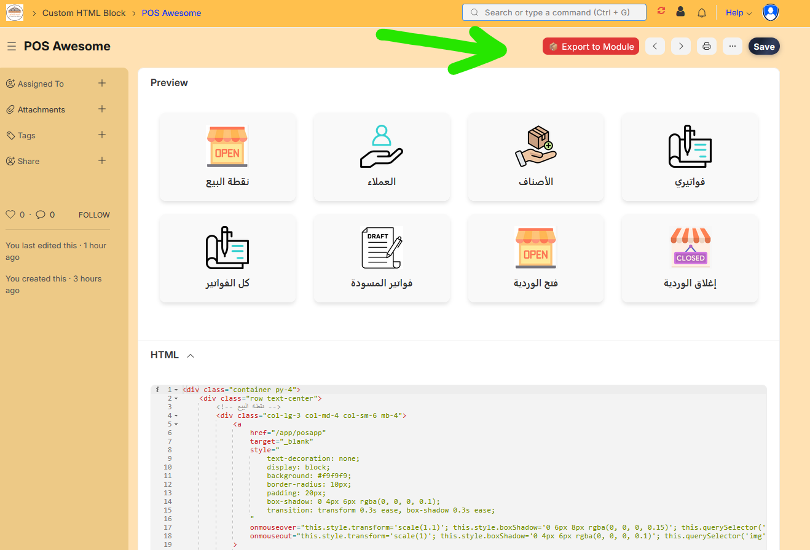
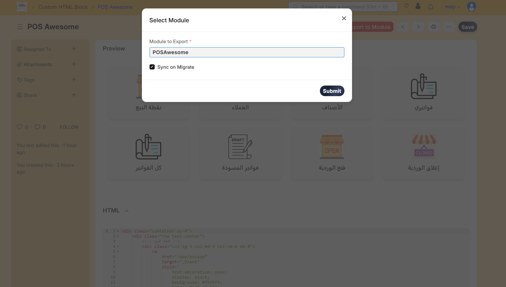
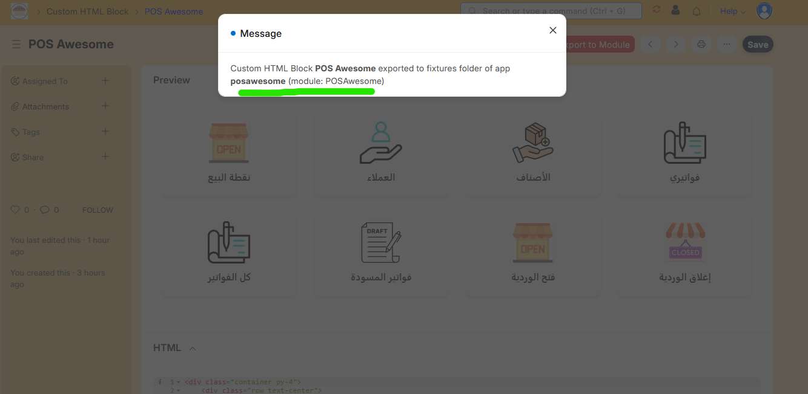

---

### Feature 6: Export from Customize Form

**How to Use:**

1. Navigate to **Customize Form** for any DocType
2. Click the **📦 Export to Module** button
3. Select the target module and configure options:
   - **Module to Export**: Choose the module containing customizations
   - **Sync on Migrate**: Enable automatic sync during migrations
4. All customizations for that module will be exported

### ❌ Old Issue

The built-in export functionality in Customize Form doesn't provide module-based filtering and requires manual selection of customizations. No easy way to export all customizations for a module at once.

### ✅ New Solution

Enhanced export button in Customize Form that allows module-based export with sync on migrate option. Exports all customizations (custom fields, property setters) for the selected module automatically.

### 📁 Export Location

```
{app_name}/{module_name}/custom/{doctype_name}.json
```

### 📸 Images

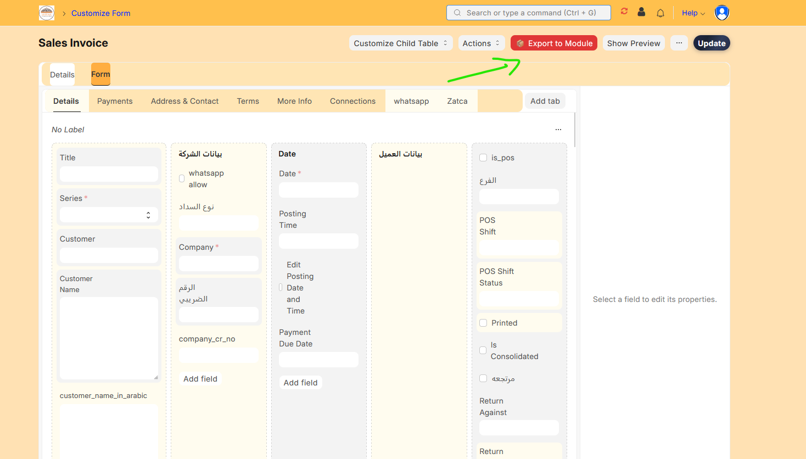

---

## 📁 Export Locations

### **Custom Fields & Property Setters**

```
{app_name}/{module_name}/custom/{doctype_name}.json
```

### **Server Scripts, Client Scripts, Custom HTML Blocks**

```
{app_name}/fixtures/{doctype_name}.json
```

---

## 🎁 What You Get

### **Custom Fields Export Includes:**

- ✅ All custom fields for the selected module
- ✅ All property setters for the selected module
- ✅ Grouped by DocType for easy management
- ✅ Sync on migrate configuration
- ✅ Standard Frappe JSON format

### **Scripts Export Includes:**

- ✅ Complete script code and configurations
- ✅ Module assignments
- ✅ Execution order (idx)
- ✅ All script metadata

### **Custom HTML Block Export Includes:**

- ✅ HTML content
- ✅ CSS styles
- ✅ JavaScript code
- ✅ Complete block configuration

---

## 🔒 Requirements

- **Developer Mode Required**: All export functions only work when developer mode is enabled
- **Module Assignment**: Most exports require documents to have a module assigned
- **Permissions**: Requires appropriate permissions to access customization forms
- **Frappe Version**: Compatible with Frappe Framework v15+

---

## 🛠️ Technical Details

### **Export Formats**

- All exports use Frappe's standard JSON format
- Compatible with `bench migrate` and fixture syncing
- Human-readable with proper indentation
- UTF-8 encoding for international characters

### **File Structure**

- Custom fields: Organized by module and DocType
- Scripts: Single file per doctype in fixtures folder
- Maintains Frappe's standard directory structure

### **Integration**

- Works seamlessly with Frappe's built-in export/import
- Compatible with `bench export-fixtures` command
- Follows Frappe's customization export patterns
- Respects Frappe's developer mode restrictions

---

## 📦 Installation

```bash
bench get-app export_custom_fields https://github.com/abdopcnet/export_custom_fields
bench --site [site-name] install-app export_custom_fields
```

---

## 🎯 Use Cases

### **Version Control**

Track all your customizations in Git, making it easy to:

- Review changes over time
- Roll back to previous versions
- Collaborate with team members
- Maintain a history of customizations

### **Deployment**

Deploy customizations across environments:

- Development → Staging → Production
- Share customizations between projects
- Maintain consistency across installations
- Automated deployment via migrations

### **Backup & Recovery**

- Backup all customizations before major changes
- Restore customizations after accidental deletion
- Maintain multiple backup versions
- Disaster recovery preparation

### **Development Workflow**

- Share customizations between developers
- Document customizations in code
- Review customization changes in pull requests
- Maintain clean, organized customization files

---

## 📝 Notes

- **Developer Mode**: All export functions require developer mode to be enabled
- **Module Required**: Most exports require documents to have a module assigned
- **File Overwriting**: Exports will overwrite existing files in the target locations
- **Git Integration**: Exported files are ready to be committed to version control
- **Migration Sync**: Use "Sync on Migrate" option for automatic synchronization

---

## 👨‍💻 Contact & Support

<div align="center">
    
</div>

- 👨‍💻 Developer: abdopcnet
- 🏢 Company: [Future Support](https://www.future-support.online/)
- 📧 Email: <abdopcnet@gmail.com>
- 🐙 GitHub: [github.com/abdopcnet/export_custom_fields](https://github.com/abdopcnet/export_custom_fields)

**🤝 Need Support or Want to Join? Contact Now:**

###  Egypt Contact

- 📞 **Call:**  [+20 115 648 3669](tel:+201156483669)
-  **WhatsApp:**  [https://wa.me/201156483669](https://wa.me/201156483669)
-  **Telegram:** [https://t.me/EG_01156483669](https://t.me/EG_01156483669)

###  Saudi Arabia Contact

- 📞 **Call:**  [+966 57 891 9729](tel:+966578919729)
-  **WhatsApp:**  [https://wa.me/966578919729](https://wa.me/966578919729)
-  **Telegram:** [https://t.me/KSA_0578919729](https://t.me/KSA_0578919729)

### 🌐 Online

- 🌐 **Website:** [future-support.online](https://www.future-support.online/)
- 📧 **Email:** <abdopcnet@gmail.com>
- 🐙 **GitHub:** [github.com/abdopcnet/export_custom_fields](https://github.com/abdopcnet/export_custom_fields)

---

<div align="center">
    <p>Made with ❤️ for Frappe developers</p>
    <p>
        <a href="https://github.com/abdopcnet/export_custom_fields">⭐ Star</a> •
        <a href="https://github.com/abdopcnet/export_custom_fields/issues">🐛 Report Bug</a> •
        <a href="https://github.com/abdopcnet/export_custom_fields/fork">🍴 Fork</a> •
        <a href="https://github.com/abdopcnet/export_custom_fields/stargazers">👀 Watch</a>
    </p>
    <p>
        
        
        
    </p>
</div>
